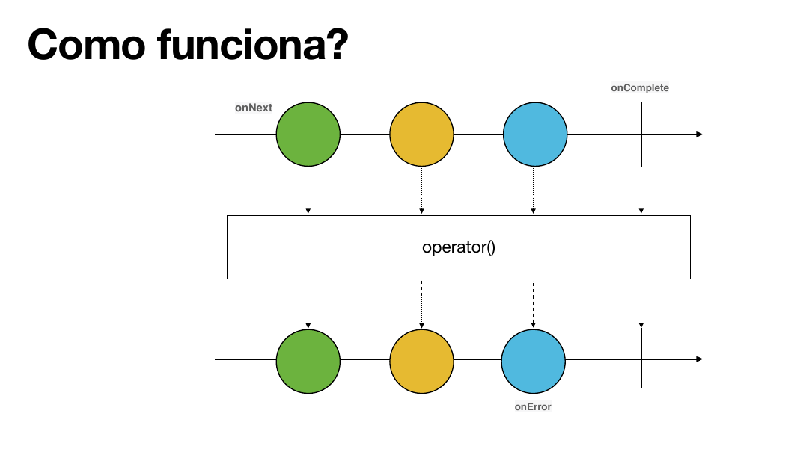

# Operadores de Criação

## Como funcionam as imagens dos exemplos



1. O fluxo inicia com o `onNext`, que emite um valor qualquer.
2. A seta para baixo indica o fluxo no tempo, onde uma operação é executada.
3. A próxima seta para baixo indica o resultado da operação.
4. A seta final à direita indica o final do fluxo, que pode ser um `onComplete` ou `onError`.

## Operadores Básicos de Criação

### Flux.just()

`Flux.just(1, 2, 3, 4)`
Cria um Flux a partir de valores estáticos fornecidos diretamente. Ideal para casos de teste ou quando você tem valores conhecidos em tempo de compilação.

### Flux.fromIterable()

`Flux.fromIterable(List.of(1, 2, 3, 4))`
Converte qualquer coleção que implemente Iterable (List, Set, etc.) em um Flux. Útil quando você já possui uma coleção de dados.

### Flux.fromArray()

`Flux.fromArray(new Integer[]{1, 2, 3, 4})`
Transforma um array em Flux. Especialmente útil quando trabalhando com arrays existentes ou dados vindos de APIs que retornam arrays.

### Flux.fromStream()

`Flux.fromStream(Stream.of(1, 2, 3, 4))`
Converte um Java Stream em Flux reativo. Permite aproveitar operações de Stream já existentes integrando com programação reativa.

### Flux.range()

`Flux.range(1, 4)`
Gera uma sequência numérica começando do primeiro parâmetro e emitindo a quantidade especificada no segundo parâmetro. Útil para loops ou sequências numéricas.

### Mono.just()

`Mono.just(1)`
Cria um Mono que emite um único valor. Usado quando você tem certeza de que haverá apenas um elemento ou resultado.

---

### Flux.create

`Flux.create(sink -> { sink.next(1); sink.complete(); })`
Cria um Flux com a capacidade de emitir múltiplos elementos de maneira síncrona ou assíncrona. Permite a emissão de elementos a partir de múltiplas threads.

```java
public class CreateOperatorTest {

    @Test
    public void testFileReadingCreate(){
        String filePath = "/Users/diegolucas/Downloads/project-reactor-examples/src/test/resources/example.txt";
        String filePath2 = "/Users/diegolucas/Downloads/project-reactor-examples/src/test/resources/example2.txt";

        Flux fileFlux = Flux.create(emitter -> { //1
            CompletableFuture<Void> task1 = CompletableFuture.runAsync(() -> readFileFluxSink(emitter, filePath)); //2
            CompletableFuture<Void> task2 = CompletableFuture.runAsync(() -> readFileFluxSink(emitter, filePath2)); //3
            CompletableFuture.allOf(task1, task2).join(); //4

            emitter.complete(); //5
        }).log();

        StepVerifier.create(fileFlux) //6
                .expectNextCount(6)
                .expectComplete()
                .verify();
    }

    private static void readFileFluxSink(FluxSink<Object> emitter, String filePath) {
        System.out.println("filePath " + filePath + " Thread " + Thread.currentThread().getName());
        try (BufferedReader reader = new BufferedReader(new FileReader(filePath))) {
            String line;
            while ((line = reader.readLine()) != null) {
                emitter.next(line);
            }
        } catch (IOException exception) {
            emitter.error(exception);
        }
    }
}
```

#### Pontos importantes do código:

1. **Criação do Flux com emitter:**
   `Flux.create(emitter -> { ... })`
   Inicia a criação do Flux fornecendo um FluxSink (emitter) que permite controle manual sobre quando e como os elementos são emitidos.

2. **Task assíncrona para o primeiro arquivo:**
   `CompletableFuture<Void> task1 = CompletableFuture.runAsync(() -> readFileFluxSink(emitter, filePath));`
   Executa a leitura do primeiro arquivo em background.

3. **Task assíncrona para o segundo arquivo:**
   `CompletableFuture<Void> task2 = CompletableFuture.runAsync(() -> readFileFluxSink(emitter, filePath2));`
   Executa a leitura do segundo arquivo em paralelo.

4. **Aguarda a conclusão de ambas as tasks:**
   `CompletableFuture.allOf(task1, task2).join();`
   Garante que ambos os arquivos sejam lidos completamente antes de finalizar o Flux.

5. **Finaliza o Flux:**
   `emitter.complete();`
   Sinaliza que não haverá mais elementos a serem emitidos.

6. **Verificação com StepVerifier:**
   `StepVerifier.create(fileFlux)...`
   Testa se 6 elementos foram emitidos e se o fluxo foi completado corretamente.

### Flux.generate

Cria um Flux com a capacidade de emitir elementos um por um de maneira **síncrona**.

```java
public class GenerateOperatorTest {

    @Test
    public void testFileReadingGenerate(){
        String filePath = "/Users/diegolucas/Downloads/project-reactor-examples/src/test/resources/example.txt"; //1

        Flux<String> fileFlux = Flux.generate(
                () -> { // 1. Estado inicial: cria o BufferedReader
                    try {
                        System.out.println("creating bufferedReader");
                        return new BufferedReader(new FileReader(filePath));
                    } catch (FileNotFoundException e) {
                        throw new RuntimeException(e);
                    }
                },
                (bufferedReader, synchronousSink) -> { // 2. Gerador: executado para cada elemento de forma síncrona
                    try {
                        String line = bufferedReader.readLine();
                        if (line != null) {
                            synchronousSink.next(line);
                        } else {
                            synchronousSink.complete();
                        }
                    } catch (IOException exception) {
                        synchronousSink.error(exception);
                    }
                    return bufferedReader;
                },
                bufferedReader -> { // 3. Consumidor: executado ao final para liberar recursos
                    try {
                        System.out.println("End - closing file");
                        bufferedReader.close();
                    } catch (IOException e) {
                        throw new RuntimeException(e);
                    }
                }
        ).log();

        StepVerifier.create(fileFlux)
                .expectNext("Line 1")
                .expectNext("Line 2")
                .expectNext("Line 3")
                .expectComplete()
                .verify();
    }
}
```

#### Pontos importantes do código:

1. **Estado inicial:**
   `() -> new BufferedReader(new FileReader(filePath))`
   Define o estado inicial do gerador, que neste caso é um `BufferedReader` para ler o arquivo.

2. **Gerador:**
   `(bufferedReader, synchronousSink) -> { ... }`
   Função chamada para cada elemento do fluxo. Lê uma linha do arquivo e emite usando `synchronousSink.next(line)`. Se não houver mais linhas, chama `synchronousSink.complete()`.

3. **Consumidor:**
   `bufferedReader -> { ... }`
   Executado quando o fluxo é completado ou ocorre um erro. Fecha o `BufferedReader` para liberar recursos.

> **Atenção:**
> O método `readLine()` do `BufferedReader` deve ser chamado apenas uma vez por iteração. Se for chamado mais de uma vez por ciclo, pode pular linhas ou encerrar o fluxo prematuramente, pois cada chamada lê a próxima linha do arquivo.
