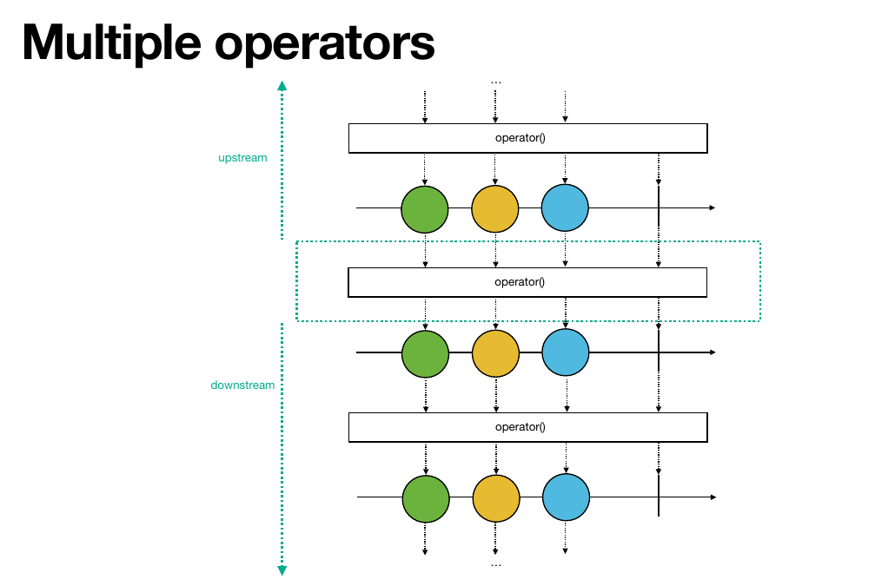
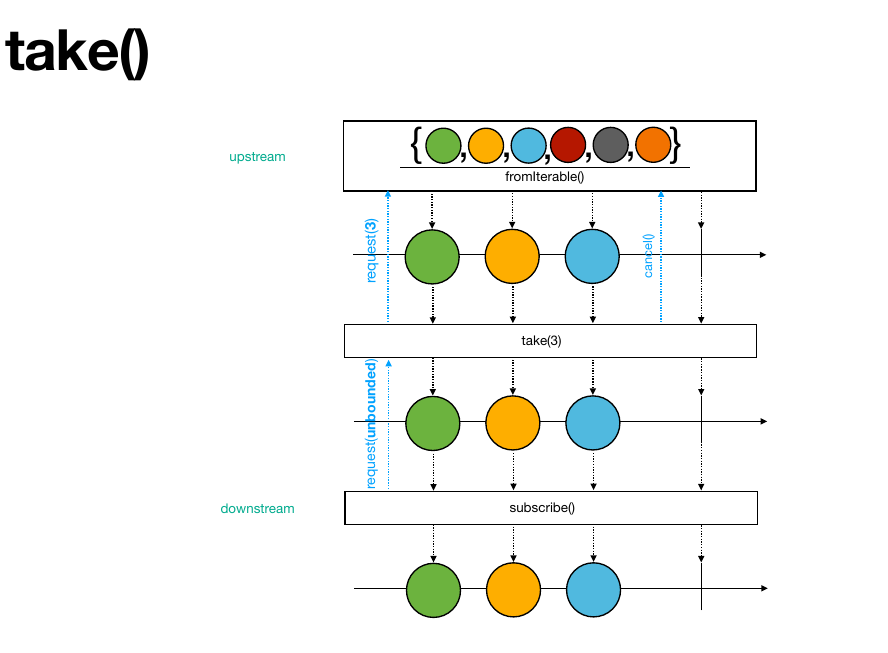
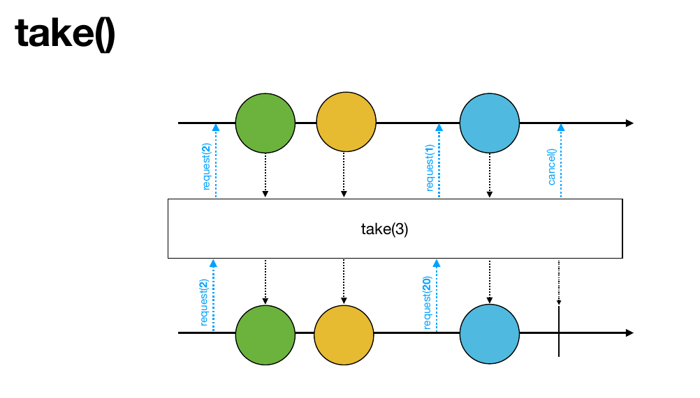
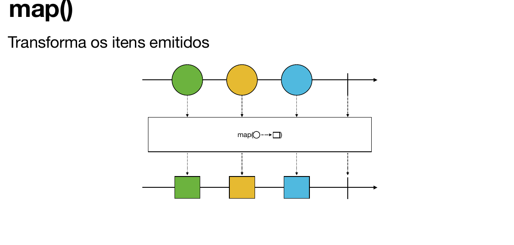
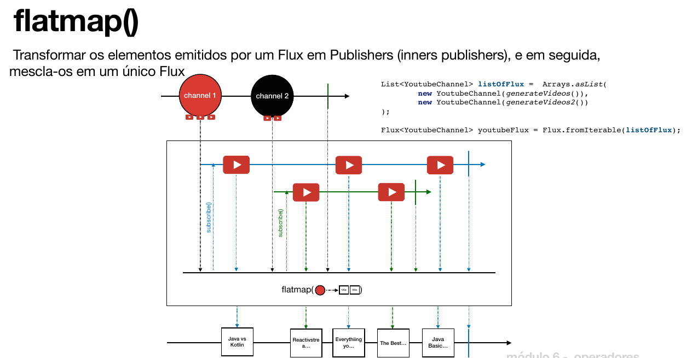

# Operadores

## Múltiplos operadores

Os operadores acima do operador central são chamados de **upstream** e os abaixo são chamados de **downstream**.

## Operador `take`

O operador `take` é usado para limitar o número de elementos emitidos por um Publisher. Ele permite especificar quantos elementos você deseja receber antes de completar o fluxo.

Outro operador semelhante é o `takeWhile`, que permite especificar uma condição para continuar recebendo elementos até que essa condição seja falsa.

## Operador `map`

O operador `map` é usado para transformar os elementos emitidos por um Publisher. Ele aplica uma função a cada elemento e emite o resultado dessa transformação. O `map` não lida com publishers aninhados, ou seja, não transforma um Publisher em outro Publisher.

## Operador `flatMap`

O operador `flatMap` é usado quando você tem uma lista de elementos e cada elemento emite outro Publisher. Nesse caso, o `flatMap` é utilizado para "achatar" os Publishers aninhados em um único fluxo. Ou seja, ele permite transformar cada elemento emitido por um Publisher em outro Publisher e, em seguida, achata esses Publishers em um único fluxo.

