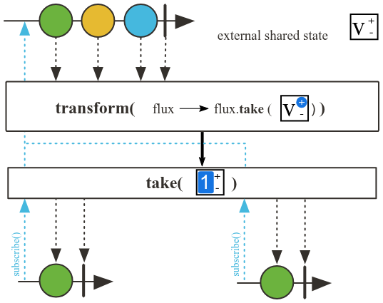

# Operadores

## Múltiplos operadores

Os operadores acima do operador central são chamados de **upstream** e os abaixo são chamados de **downstream**.

## Operador `take`

O operador `take` é usado para limitar o número de elementos emitidos por um Publisher. Ele permite especificar quantos elementos você deseja receber antes de completar o fluxo.

Outro operador semelhante é o `takeWhile`, que permite especificar uma condição para continuar recebendo elementos até que essa condição seja falsa.

> o operador `take` funcionar para operações upstream, qualquer operador antes do `take` será executado normalmente, mas após o `take`,

## Operador `map`

O operador `map` é usado para transformar os elementos emitidos por um Publisher. Ele aplica uma função a cada elemento e emite o resultado dessa transformação. O `map` não lida com publishers aninhados, ou seja, ele não "achata" os resultados. Se você precisar lidar com Publishers aninhados, deve usar o operador `flatMap`.

## Operador `flatMap`

O operador `flatMap` é usado quando você tem uma lista de elementos e cada elemento emite outro Publisher. Nesse caso, o `flatMap` é utilizado para "achatar" os Publishers aninhados em um único fluxo. Ou seja, ele permite transformar cada elemento emitido por um Publisher em outro Publisher e, em seguida, achata esses Publishers em um único fluxo.

## Operador `filter`

O operador `filter` é usado para filtrar os elementos emitidos por um Publisher com base em uma condição. Ele permite que você especifique uma função de teste e emite apenas os elementos que atendem a essa condição.

## Operador `delayElement`
O operador `delayElement` é usado para atrasar a emissão de um elemento por um determinado período de tempo. Ele pode ser útil quando você deseja simular uma latência ou atraso na emissão de elementos.erros não são atrasados.

## Operador `transform`

O operador `transform` é usado para aplicar uma transformação a um Publisher, permitindo encapsular a lógica de transformação em um método separado. É útil para reutilizar transformações em diferentes fluxos.

## Operadores de efeito colateral (side effect)

- **doFirst:** Executa uma ação antes de qualquer elemento ser emitido.
- **doOnSubscribe:** Executa uma ação quando um Subscriber se inscreve no Publisher.
- **doOnRequest:** Executa uma ação quando um Subscriber solicita elementos do Publisher.
- **doOnNext:** Executa uma ação para cada elemento emitido pelo Publisher.
- **doOnError:** Executa uma ação quando ocorre um erro durante a emissão de elementos.
- **doOnCancel:** Executa uma ação quando a assinatura é cancelada.
- **doOnComplete:** Executa uma ação quando o Publisher completa a emissão de elementos.
- **doAfterTerminate:** Executa uma ação após a conclusão do Publisher, independentemente de ter sido bem-sucedido ou com erro.
- **doFinally:** Executa uma ação após a conclusão do Publisher, independentemente do motivo (onComplete, onError ou cancelamento).

---

## Resumo dos principais operadores

- **just(), fromIterable(), fromArray(), fromStream(), range(), Mono.just():** Métodos de criação.
- **take():** Limita o número de elementos emitidos por um Flux ou Mono.
- **filter():** Filtra valores emitidos.
- **map():** Transforma os itens emitidos.
- **flatMap():** Transforma os elementos emitidos em Publishers internos e os mescla em um único Flux.
- **delayElements():** Atrasa a emissão de cada elemento por um determinado tempo.
- **transform():** Aplica uma transformação customizada ao Flux ou Mono.
- **Operadores de efeito colateral (side effects):** Permitem adicionar efeitos colaterais sem modificar o fluxo de dados.
