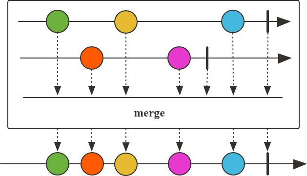
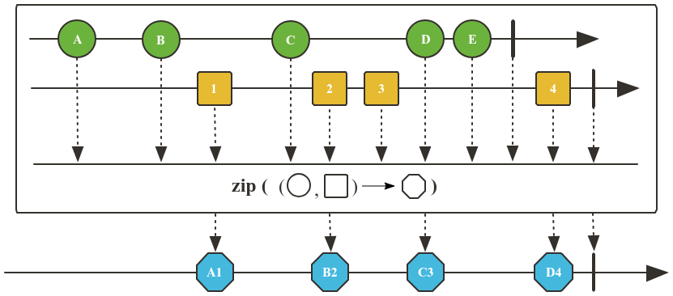

# Combinando Fluxos com Operadores

## Operador `concat`

O operador `concat` é usado para combinar dois ou mais fluxos de dados (Flux ou Mono) em um único fluxo. Ele emite todos os elementos do primeiro fluxo até que ele complete, e então passa para o próximo fluxo, e assim por diante. O `concat` preserva a ordem dos elementos. É possível usar tanto o `concat` quanto o `concatWith` para combinar fluxos.

## Operador `merge`

O operador `merge` combina dois ou mais fluxos de dados em um único fluxo, emitindo os elementos à medida que eles chegam, sem garantir a ordem. Os elementos dos fluxos combinados podem ser emitidos em qualquer ordem, dependendo de quando cada fluxo produz seus elementos.

## Operador `zip`

O operador `zip` combina os elementos de dois ou mais fluxos de dados, emitindo um novo elemento que é uma combinação dos elementos correspondentes de cada fluxo. O `zip` emite um elemento somente quando todos os fluxos tiverem emitido um elemento correspondente. Se um dos fluxos não emitir mais elementos, o `zip` não emitirá mais elementos.

---

**Resumo dos operadores de combinação:**

- **concat():** Concatena os elementos de forma sequencial.
- **merge():** Mescla múltiplos Publishers em uma sequência intercalada.
- **zip():** Combina os elementos de múltiplos fluxos em um único fluxo, emitindo pares correspondentes.
