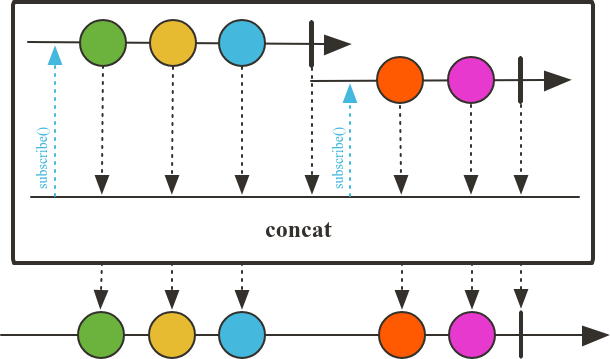

# Combinando Fluxos com Operadores

## Operador `concat`

O operador `concat` é usado para combinar dois ou mais fluxos de dados (Flux ou Mono) em um único fluxo. Ele emite todos os elementos do primeiro fluxo até que ele complete, e então passa para o próximo fluxo, e assim por diante. É importante notar que o `concat` preserva a ordem dos elementos. É possível usar tanto o `concat` quanto o `concatWith` para combinar fluxos.

