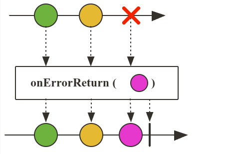

# Tratamento de erros

## Operador `onErrorReturn`

O operador `onErrorReturn` é usado para fornecer um valor padrão quando ocorre um erro durante a emissão de elementos. Ele permite que você defina um valor de fallback que será emitido em vez do erro.

```java
YoutubeChannel youtubeChannel = new YoutubeChannel(MockVideo.generateVideos());

MonetizationCalculator monetizationCalculator = new MonetizationCalculator();

youtubeChannel.getAllVideos()
        .flatMap(video -> monetizationCalculator.calculate(video))
        .onErrorReturn(0.0)
        .subscribe(value -> System.out.println("$ " + value));
```



## Operador `onErrorResume`

O operador `onErrorResume` é usado para fornecer um Publisher alternativo quando ocorre um erro. Ele permite que você retorne um novo Publisher em vez de emitir o erro.

```java
YoutubeChannel youtubeChannel = new YoutubeChannel(MockVideo.generateVideos());

MonetizationCalculator monetizationCalculator = new MonetizationCalculator();

youtubeChannel.getAllVideos()
        .flatMap(video -> monetizationCalculator.calculate(video))
        .onErrorResume(exception -> {
            System.out.println("onErrorResume");
            return Flux.just(0.0, 999.00);
        })
        .subscribe(value -> System.out.println(value));
```


## Operador `onErrorContinue`

O operador `onErrorContinue` é usado para ignorar um erro e continuar a emissão de elementos. Ele permite que você especifique uma ação a ser executada quando ocorre um erro, mas não interrompe o fluxo.

```java
YoutubeChannel youtubeChannel = new YoutubeChannel(MockVideo.generateVideos());

MonetizationCalculator monetizationCalculator = new MonetizationCalculator();

youtubeChannel.getAllVideos()
        .flatMap(video -> monetizationCalculator.calculate(video))
        .onErrorContinue((throwable, object) -> {
            Video video = (Video) object;
            System.out.println("onErrorContinue " + video.getName());
        })
        .subscribe(value -> System.out.println(value));
```


## Operador `onErrorMap`

O operador `onErrorMap` é usado para mapear um erro para uma exceção diferente. Ele permite que você transforme o erro original em uma exceção personalizada ou diferente antes de propagá-lo.

```java
YoutubeChannel youtubeChannel = new YoutubeChannel(MockVideo.generateVideos());

MonetizationCalculator monetizationCalculator = new MonetizationCalculator();

youtubeChannel.getAllVideos()
        .flatMap(video -> monetizationCalculator.calculate(video))
        .onErrorMap(exception -> {
            System.out.println("onErrorMap");
            return new CustomPersonalizedException("Erro personalizado", exception);
        })
        .subscribe(value -> System.out.println(value));
```


## Operador `onErrorComplete`

O operador `onErrorComplete` é usado para completar o fluxo quando ocorre um erro, sem emitir o erro. Ele permite que você ignore o erro e finalize o fluxo normalmente.

```java
@Test
public void onErrorCompleteMonetization() {
    YoutubeChannel youtubeChannel = new YoutubeChannel(MockVideo.generateVideos());

    MonetizationCalculator monetizationCalculator = new MonetizationCalculator();

    youtubeChannel.getAllVideos()
            .flatMap(video -> monetizationCalculator.calculate(video))
            .onErrorComplete()
            .doFinally(signalType -> System.out.println("Sinal " + signalType))
            .subscribe(value -> System.out.println(value));
}
```


## Operadores `isEmpty` e `switchIfEmpty`

1. **`isEmpty`:** Verifica se o Publisher não emitiu nenhum elemento e retorna um Mono<Boolean> indicando se está vazio ou não. Ele exibe apenas se todos os resultados forem vazios.
2. **`switchIfEmpty`:** Permite fornecer um Publisher alternativo que será emitido se o Publisher original estiver vazio. É útil para fornecer um fallback quando não há elementos.


## Operador `retry`

O operador `retry` é usado para reemitir os elementos de um Publisher quando ocorre um erro. Ele permite que você especifique quantas vezes deseja tentar novamente antes de falhar completamente. Existe uma outra implementação do operador `retryWhen`, que permite definir uma lógica personalizada para reemitir os elementos em caso de erro, normalmente usamos o `retryWhen` quando queremos definir uma lógica de reemissão mais complexa, como atrasos entre as tentativas ou condições específicas para reemissão.


### Exemplo com `retry`:

```java
YoutubeChannel youtubeChannel = new YoutubeChannel(MockVideo.generateVideos());

MonetizationCalculator monetizationCalculator = new MonetizationCalculator();

youtubeChannel.getAllVideos()
        .flatMap(video -> monetizationCalculator.calculate(video))
        .retry(2)
        .subscribe(value -> System.out.println(value));
```

### Exemplo com `retryWhen`:

```java
YoutubeChannel youtubeChannel = new YoutubeChannel(MockVideo.generateVideos());

VideoAnalyser videoAnalyser = new VideoAnalyser();

youtubeChannel.getAllVideos()
        .log()
        .map(video -> videoAnalyser.analyse(video))
        .retryWhen(Retry.fixedDelay(2, Duration.ofSeconds(2)))
        .subscribe();

Thread.sleep(10000);
```


---

## Resumo dos operadores de tratamento de erros

### Operadores de erro:

- **`onErrorReturn`:** Define um valor padrão para ser retornado em caso de erro
- **`onErrorResume`:** Permite definir um Publisher de fallback em caso de erro
- **`onErrorContinue`:** Permite continuar a execução mesmo após ocorrer um erro
- **`onErrorMap`:** Transforma um tipo de erro em outro
- **`onErrorComplete`:** Descarta o erro e simplesmente completa o Flux ou Mono

### Operadores para valores vazios:

- **`defaultIfEmpty`:** Define um valor padrão para ser emitido caso o Flux ou Mono esteja vazio
- **`switchIfEmpty`:** Troca o Flux ou Mono por outro Flux ou Mono alternativo caso esteja vazio

### Operadores de retry:

- **`retry`:** Tenta novamente a operação em caso de erro
- **`retryWhen`:** Tenta novamente a operação em caso de erro, de forma customizável
