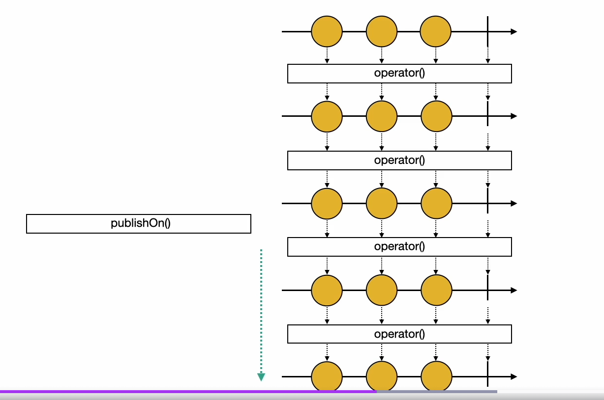
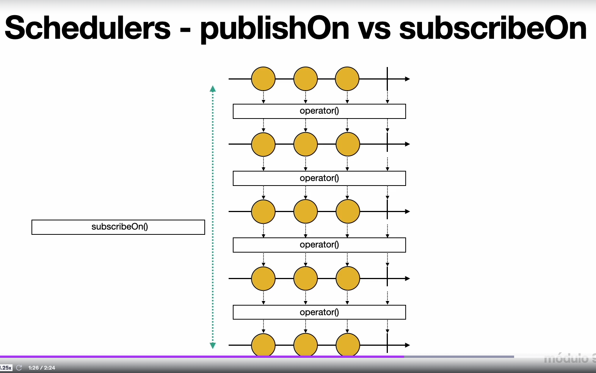
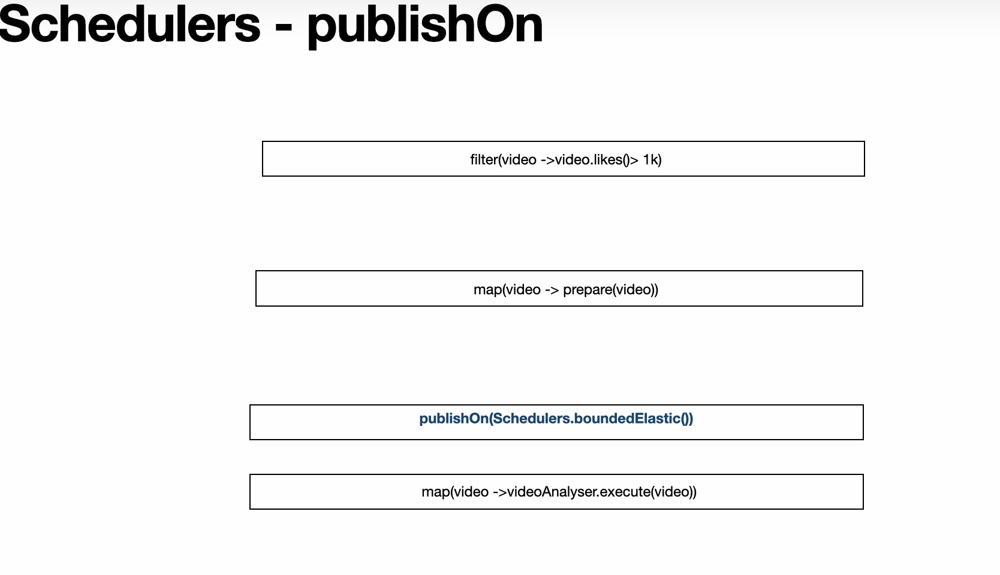

# Schedulers

Schedulers são abstrações que oferecem maior controle sobre em qual thread ou contexto as tarefas devem ser executadas. São úteis para operações que podem bloquear recursos, permitindo solicitar ao Reactor que execute uma tarefa em uma thread separada e, assim, evitar o bloqueio do fluxo principal.

## Tipos de Schedulers

- **boundedElastic():** Otimizado para execuções mais longas ou operações bloqueantes. Cria até 10 vezes o número de núcleos de CPU em threads.
- **parallel():** Otimizado para operações intensivas de CPU ou cálculos pesados. Cria até o número de núcleos de CPU em threads.
- **single():** Otimizado para execuções únicas de baixa latência. Utiliza uma única thread.

## Operadores `publishOn` vs `subscribeOn`

- **publishOn:** Define o Scheduler para as operações abaixo no fluxo.
- **subscribeOn:** Define o Scheduler para toda a pipeline, desde o início.







```java
@Test
public void publishOnBlockingOperation() throws InterruptedException {
    YoutubeChannel youtubeChannel = new YoutubeChannel(MockVideo.generateVideos3());

    Flux<String> videos = youtubeChannel.getAllVideos()
            .filter(video -> {
                System.out.println("Filter1 - Thread: " + Thread.currentThread().getName());
                return video.getDescription().length() > 10;
            })
            .map(video -> {
                System.out.println("Map1 - Thread: " + Thread.currentThread().getName());
                return video.getDescription();
            })
            .publishOn(Schedulers.boundedElastic()) // Define o Scheduler para as operações abaixo
            .map(description -> {
                try {
                    Thread.sleep(1000);
                    System.out.println("Map2 - Thread: " + Thread.currentThread().getName());
                } catch (InterruptedException e) {
                    throw new RuntimeException(e);
                }
                return description.toUpperCase();
            });

    // Não esqueça de subscrever para executar o fluxo
    videos.subscribe();
    Thread.sleep(5000);
}
```

## Operador `parallel`

O operador `parallel` é usado para dividir o fluxo em múltiplos fluxos paralelos, permitindo que as operações sejam executadas simultaneamente em várias threads. É útil para melhorar o desempenho em operações intensivas de CPU.

```java
@Test
public void parallelBlockingOperation() throws InterruptedException {
    YoutubeChannel youtubeChannel = new YoutubeChannel(MockVideo.generateVideos());

    VideoAnalyser videoAnalyser = new VideoAnalyser();

    youtubeChannel.getAllVideos()
            .filter(video -> {
                System.out.println("Filter 1 - Thread: " + Thread.currentThread().getName());
                return video.getDescription().length() > 10;
            })
            .parallel()
            .runOn(Schedulers.boundedElastic())
            // .publishOn(Schedulers.parallel())
            .map(video -> videoAnalyser.analyseBlocking(video))
            .sequential()
            .subscribe();

    Thread.sleep(30000);
}
```

> É possível alcançar o mesmo resultado com `publishOn`, tornando o método `analyseBlockingMono` um Mono e usando `publishOn(Schedulers.boundedElastic())` ou `subscribeOn(Schedulers.boundedElastic())`. Podemos usar o `publishOn` para definir o scheduler onde as operações subsequentes serão executadas.

---

## Resumo dos Schedulers

Scheduler é uma abstração que dá ao usuário controle sobre o threading.

Existem 3 tipos principais de schedulers:

- `boundedElastic()`
- `parallel()`
- `single()`

**Principais operadores:**

- `publishOn(Scheduler scheduler)`: Define o scheduler onde as operações subsequentes do fluxo (como map, filter, etc.) serão executadas.
- `subscribeOn(Scheduler scheduler)`: Define o scheduler onde todas as operações do fluxo (upstream e downstream) serão executadas.
- `parallel().runOn(Scheduler scheduler)`: Permite executar operações simultaneamente em paralelo em várias threads.
- `Mono.fromCallable(() -> function()).publishOn(Scheduler scheduler)`: Recebe uma função e produz um Mono que é executado em uma thread paralela.
