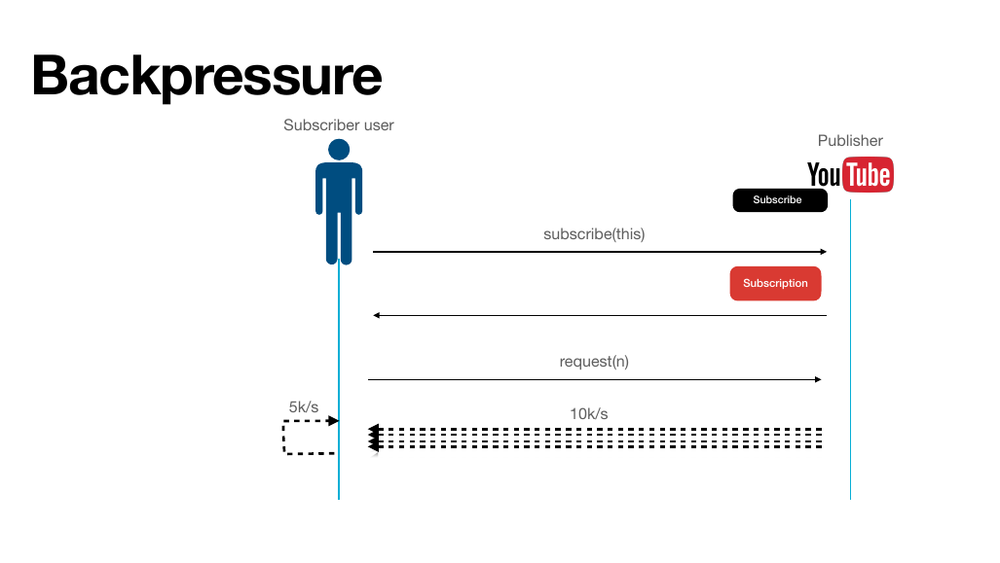
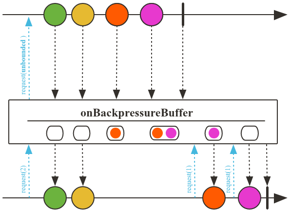
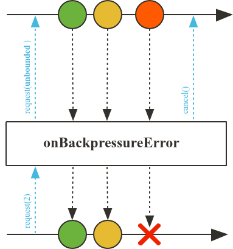
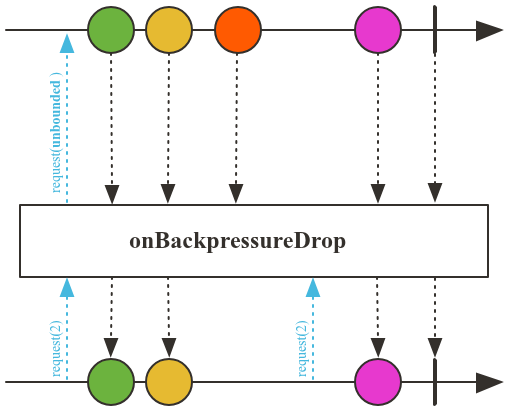
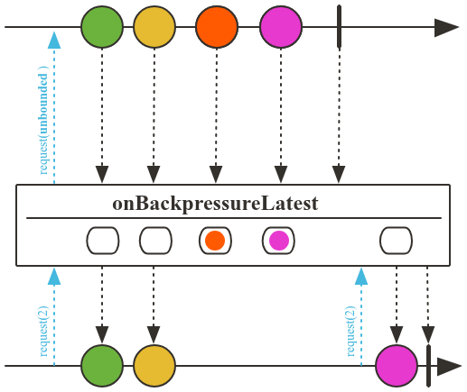
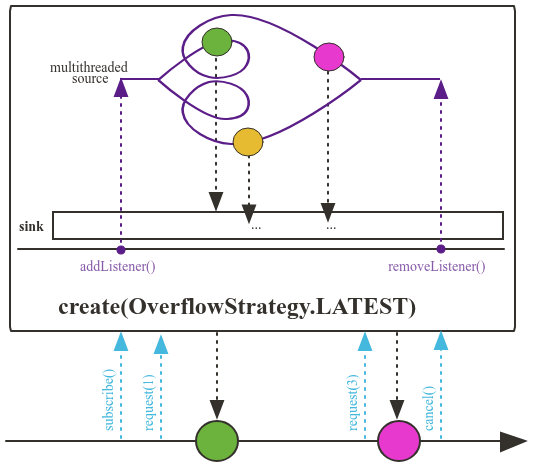
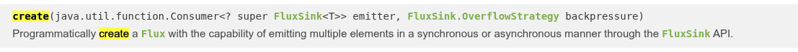
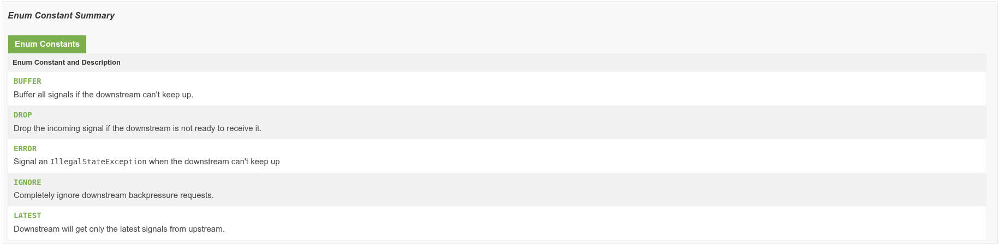

# Backpressure



Backpressure é um mecanismo de controle para lidar com a discrepância de velocidade entre a produção e o consumo de dados em fluxos reativos.

## Estratégias de Backpressure

### Buffer

Armazena os eventos em um buffer. Pode levar ao consumo excessivo de memória se o consumidor não acompanhar o produtor.



```java
@Test
public void backPressureBuffer() throws InterruptedException {
    System.setProperty("reactor.bufferSize.small", "16"); // 1

    Flux.interval(Duration.ofMillis(1))
            .onBackpressureBuffer(20) // 2
            .log("filter")
            .publishOn(Schedulers.single()) // 3
            .map(number -> { // operação lenta
                try {
                    Thread.sleep(500);
                } catch (InterruptedException e) {
                    throw new RuntimeException(e);
                }
                System.out.println(Thread.currentThread().getName() + " Consuming number " + number);
                return number;
            })
            .subscribe();

    Thread.sleep(500_000);
}
```

1. Define o tamanho do buffer pequeno para 16 elementos.
2. Configura o buffer para armazenar até 20 elementos quando ocorrer backpressure.
3. Utiliza o scheduler single para processar os elementos em uma thread separada.
4. O método `map` simula uma operação lenta, fazendo uma pausa de 500ms para cada elemento processado.

---

### Error

Se usamos o Project Reactor, por padrão é usada essa estratégia de backpressure, onde o fluxo é interrompido e um erro é emitido quando o buffer está cheio.



```java
@Test
public void backPressureError() throws InterruptedException {
    System.setProperty("reactor.bufferSize.small", "16");

    Flux.interval(Duration.ofMillis(1))
            .onBackpressureError() // 1
            .publishOn(Schedulers.single())
            .map(number -> {
                try {
                    Thread.sleep(500);
                } catch (InterruptedException e) {
                    throw new RuntimeException(e);
                }
                System.out.println(Thread.currentThread().getName() + " Consuming number " + number);
                return number;
            })
            .subscribe();

    Thread.sleep(500_000);
}
```

1. Configura o fluxo para emitir um erro quando ocorrer backpressure, ou seja, quando o buffer estiver cheio.

---

### Drop

Essa estratégia descarta os eventos que não podem ser processados imediatamente, evitando o acúmulo de dados no buffer.



```java
@Test
public void backPressureDrop() throws InterruptedException {
    System.setProperty("reactor.bufferSize.small", "16");

    Flux.interval(Duration.ofMillis(1))
            .onBackpressureDrop()
            .publishOn(Schedulers.single())
            .map(number -> {
                try {
                    Thread.sleep(500);
                } catch (InterruptedException e) {
                    throw new RuntimeException(e);
                }
                System.out.println(Thread.currentThread().getName() + " Consuming number " + number);
                return number;
            })
            .subscribe();

    Thread.sleep(500_000);
}
```

---

### Latest

Essa estratégia mantém apenas o último evento recebido, descartando os anteriores quando o buffer está cheio.



```java
@Test
public void backPressureLatest() throws InterruptedException {
    System.setProperty("reactor.bufferSize.small", "16");

    Flux.interval(Duration.ofMillis(1))
            .onBackpressureLatest() // 1
            .publishOn(Schedulers.single())
            .map(number -> {
                try {
                    Thread.sleep(500);
                } catch (InterruptedException e) {
                    throw new RuntimeException(e);
                }
                System.out.println(Thread.currentThread().getName() + " Consuming number " + number);
                return number;
            })
            .subscribe();

    Thread.sleep(500_000);
}
```

1. Configura o fluxo para manter apenas o último evento recebido quando ocorrer backpressure, descartando os anteriores.

---

## Backpressure e Flux.create

O método `Flux.create` permite criar um fluxo reativo com controle de backpressure, conforme a documentação do Project Reactor.





```java
@Test
public void createOperatorBackPressureStrategies() throws InterruptedException {
    System.setProperty("reactor.bufferSize.small", "16");

    Flux<Object> fluxTest = Flux.create(emitter -> {
        for (int i = 0; i < 1_000_000; i++) {
            emitter.next(i);
        }
        emitter.complete();
    }, FluxSink.OverflowStrategy.LATEST);

    fluxTest
            .publishOn(Schedulers.boundedElastic())
            .map(number -> {
                try {
                    Thread.sleep(1);
                } catch (InterruptedException e) {
                    throw new RuntimeException(e);
                }
                System.out.println(Thread.currentThread().getName() + " Consuming number " + number);
                return number;
            })
            .subscribe();

    Thread.sleep(1_000_000);
}
```

---

## Resumo

Backpressure é um mecanismo de controle para lidar com a discrepância de velocidade entre a produção e o consumo de dados em fluxos reativos.

- `onBackpressureBuffer()`: Armazena os elementos em um buffer temporariamente quando não há demanda suficiente no downstream.
- `onBackpressureError()`: Gera um erro de backpressure imediatamente quando não há demanda suficiente no downstream.
- `onBackpressureDrop()`: Descarta elementos quando não há demanda suficiente no downstream.
- `onBackpressureLatest()`: Mantém apenas o último elemento emitido no buffer quando não há demanda suficiente no downstream, permitindo que o mais recente substitua os anteriores.

O `Flux.create` com controle de backpressure permite criar fluxos reativos com diferentes estratégias de overflow, como `LATEST`, `BUFFER`, `DROP`, entre outras.
