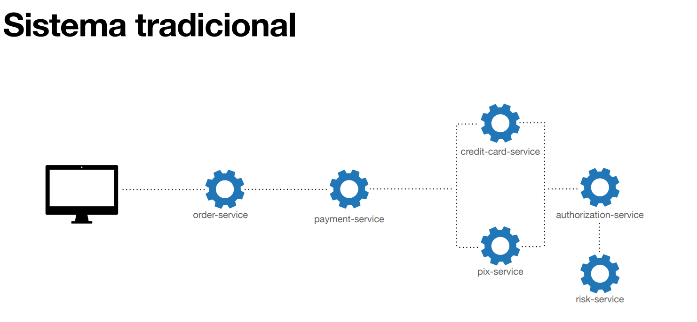
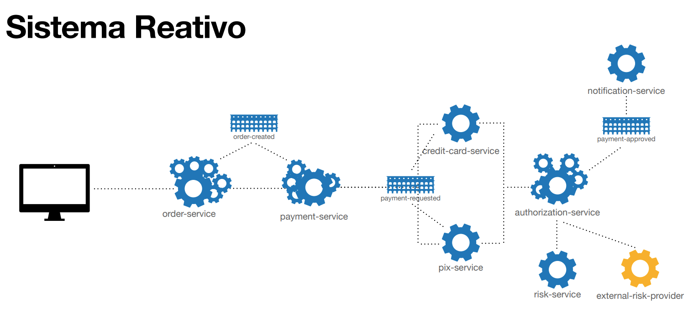
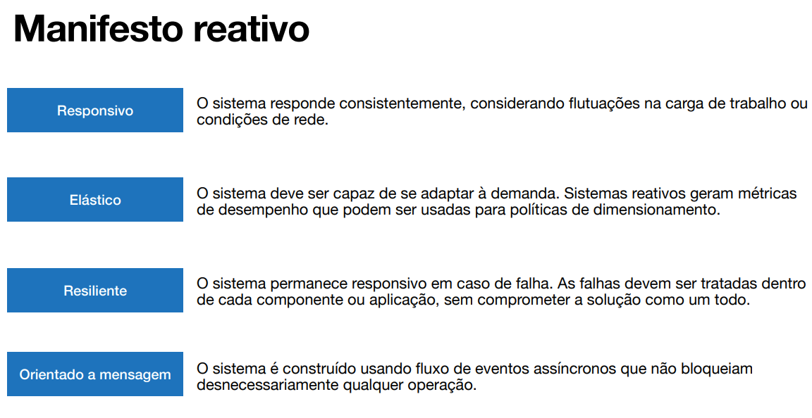
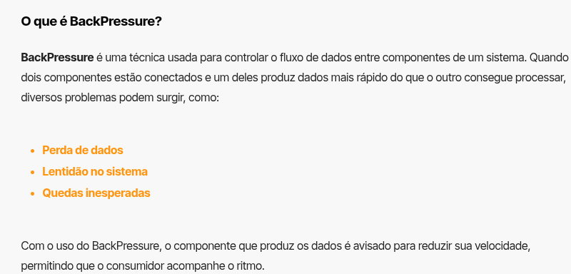
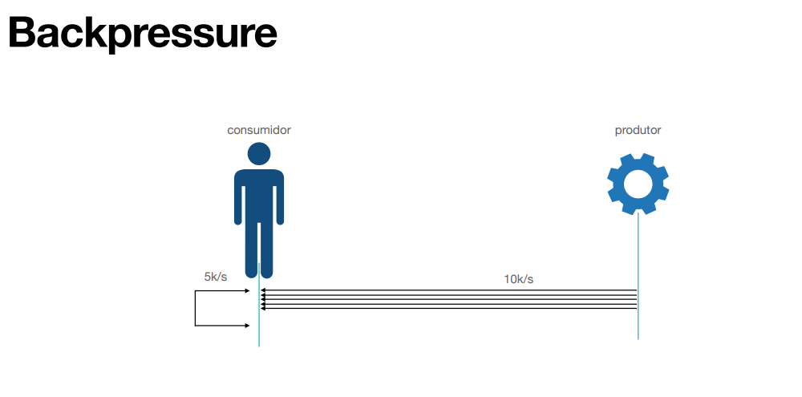
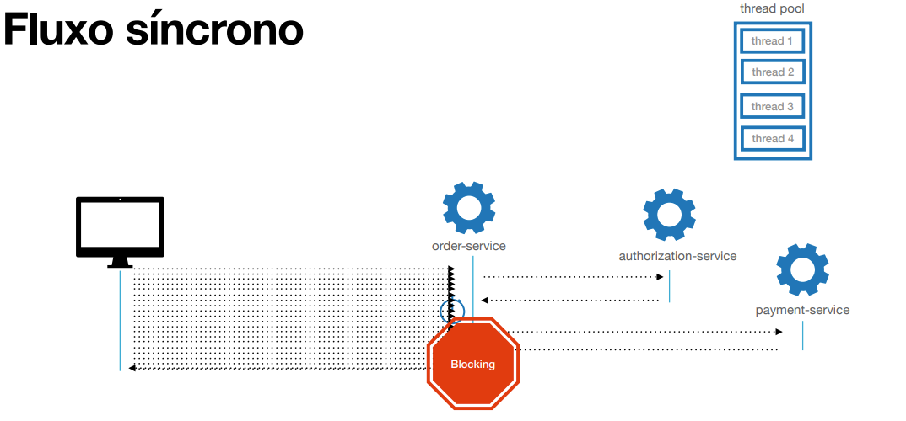
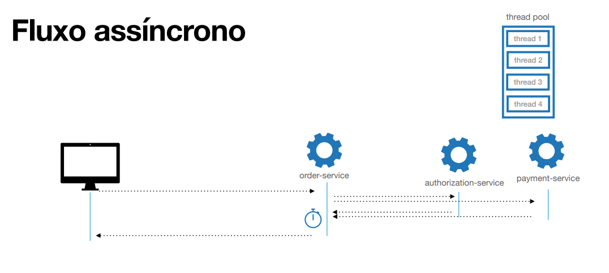
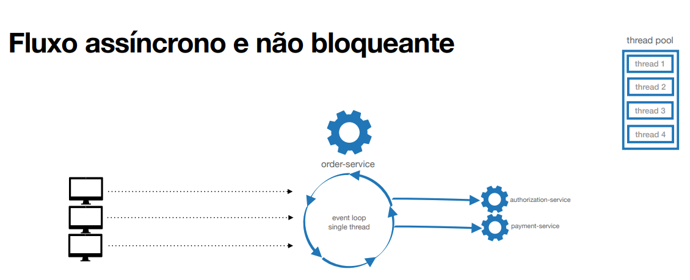

# Conceitos

## Sistema tradicional

Um sistema tradicional é caracterizado por um modelo normalmente síncrono, onde as operações bloqueiam a execução até serem concluídas.

## Sistema reativo

Um sistema reativo é projetado para ser altamente responsivo, resiliente e elástico, lidando de forma eficaz com solicitações e falhas, garantindo desempenho consistente. Esses sistemas normalmente são orientados a eventos e utilizam ferramentas como mensagerias e filas para gerenciar a comunicação entre componentes.

## [Manifesto Reativo](https://www.reactivemanifesto.org/pt-BR)

O Manifesto Reativo define os princípios fundamentais para o desenvolvimento de sistemas reativos, enfatizando a importância de sistemas responsivos, resilientes, elásticos e orientados a eventos:

1. **Responsivo:** O sistema responde consistentemente, mesmo com variações de carga ou condições de rede.
2. **Elástico:** O sistema se adapta à demanda, podendo escalar conforme necessário.
3. **Resiliente:** O sistema permanece responsivo mesmo em caso de falhas, que devem ser tratadas dentro de cada componente sem comprometer o todo.
4. **Orientado a eventos:** O sistema reage a eventos, promovendo comunicação assíncrona e desacoplamento entre componentes.

## Programação Reativa

É uma abordagem no desenvolvimento de software que se concentra em lidar com
a propagação de mudanças em fluxos de dados (data streams) de forma
assíncrona e não bloqueante com mecanismo de backpressure, permitindo
que sistemas reajam automaticamente a essas mudanças.

1. Foco em desenvolmento assincrono e não bloqueante.
2. Programação funcional.
3. Propagação de mudanças em um fluxo de dados (data streams)
4. Controle de backpressure.

1. **Fluxo síncrono** - caracterizado por bloqueio de recursos e operações em sequeêcia

2 **Fluxo assíncrono** - caracterizado por operação que pode ser executada em paralelo

3. **fluxo assíncrono não bloqueante** - caracterizado por operações que não bloqueiam o fluxo de dados, permitindo que outras operações sejam executadas enquanto aguardam a conclusão de uma tarefa.

> Para garantir de certa forma o não bloqueio é necessario o uso da abordagem de event loop sigle thread, onde um único thread é responsável por gerenciar todas as operações assíncronas, essa ttheaed não fica bloqueada esperando a conclusão de uma operação, mas sim continua processando outras tarefas enquanto aguarda a resposta da operação assíncrona.

## Resumo

1. **Sistema reativo** - Sistemas construídos de forma responsiva, resiliente,
escaláveis e orientados a mensagens.
2. **Programação reativa** - Paradigma de programação que reage a eventos de
forma assíncrona e não bloqueante com backpressure
3. **Fluxo síncrono** - Execução sequencial de tarefas, aguardando a conclusão de
cada uma antes de continuar para a próxima.
4. **Fluxo assíncrono** - Execução simultânea de tarefas, permitindo paralelismo.
5. **Não bloqueante** - Capacidade de um programa continuar a execução sem ser
bloqueado por uma outra tarefa
6. **Backpressure** - Mecanismo de controle para lidar com a discrepância de
velocidade entre a produção e consumo de dados.
