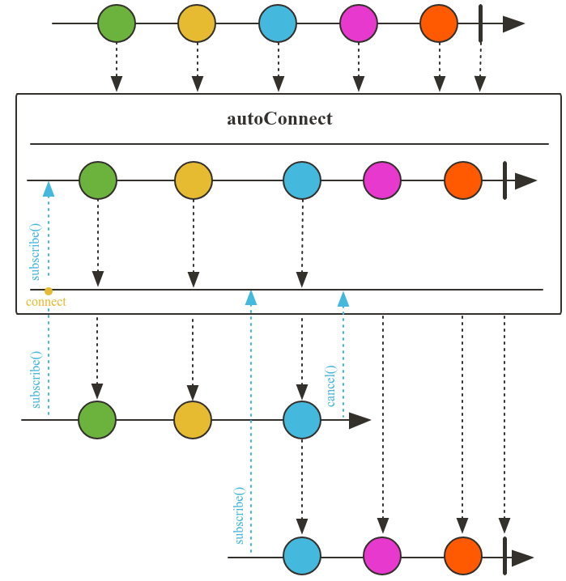
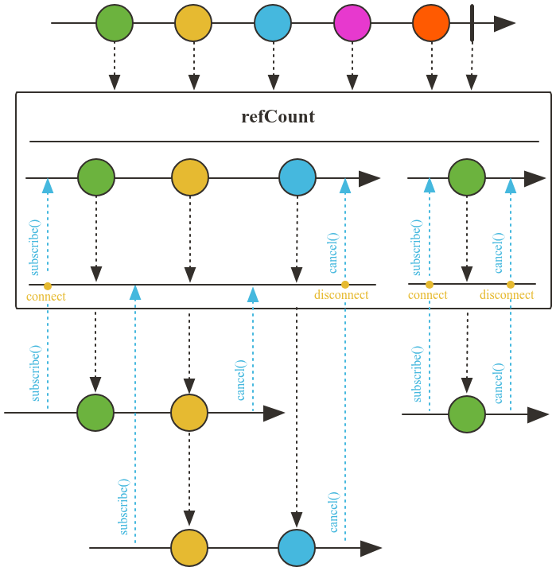
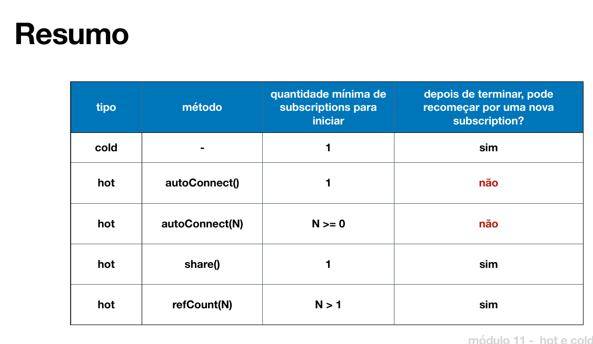

# Hot e Cold Publisher

## Operador `autoConnect`

Existe uma fonte de dados que produz elementos e os emite para os assinantes, conforme a imagem abaixo:



É possível configurar a quantidade mínima de assinantes para que o publisher comece a emitir os dados. Por exemplo, se o publisher for configurado para emitir apenas quando houver 10 assinantes, ele só começará a emitir quando atingir esse número. Caso o Flux termine, os dados não são redistribuídos para novos assinantes, ou seja, o publisher não emite novamente os dados para novos assinantes.

```java
public Flux<String> play() {
    return Flux.interval(Duration.ofMillis(500))
            .map(value -> getLiveEvent(value))
            .takeWhile(event -> !event.equals("End"))
            .publish().autoConnect(); // default é 1 assinante
}

public Flux<String> playN() {
    return Flux.interval(Duration.ofMillis(500))
            .map(value -> getLiveEvent(value))
            .takeWhile(event -> !event.equals("End"))
            .publish().autoConnect(2); // aqui o publisher só emitirá quando tiver 2 assinantes
}
```

## Operador `share`

É possível compartilhar o publisher com vários assinantes usando o operador `share`. O `share` é equivalente a `publish().refCount(1)`. Para casos em que se deseja um número mínimo de assinantes, pode-se usar `publish().refCount(n)`. Quando o número mínimo de assinantes é atingido, o publisher começa a emitir os dados. Se todos os assinantes se desconectarem e uma nova subscription for criada, o publisher reinicia e emite novamente os dados.



```java
public Flux<String> playShare() {
    return Flux.interval(Duration.ofMillis(500))
            .map(value -> getLiveEvent(value))
            .takeWhile(event -> !event.equals("End"))
            .share(); // compartilha o publisher com vários assinantes
}

public Flux<String> playShareN() {
    return Flux.interval(Duration.ofMillis(500))
            .map(value -> getLiveEvent(value))
            .takeWhile(event -> !event.equals("End"))
            .publish().refCount(2); // aqui o publisher só emitirá quando tiver 2 assinantes
}
```



## Resumo

- **Cold Publisher:** Produz dados sob demanda, ou seja, o publisher só emite dados quando há assinantes. Cada novo assinante recebe todos os dados desde o início.
- **Hot Publisher:** Produz dados independentemente dos assinantes ou pode ser configurado para começar a emitir após um número mínimo de assinantes. Novos assinantes podem perder eventos já emitidos.
- O operador `autoConnect` permite configurar o número mínimo de assinantes para que o publisher comece a emitir dados. Após atingir esse número, os dados são emitidos e não são reenviados para novos assinantes.
- O operador `share` permite compartilhar o publisher com vários assinantes. Se todos os assinantes se desconectarem, ao surgir um novo assinante, o fluxo é reiniciado.
- O operador `publish().refCount(n)` permite definir um número mínimo de assinantes para que o publisher comece a emitir dados. Se todos se desconectarem, o fluxo é reiniciado para novos assinantes.


