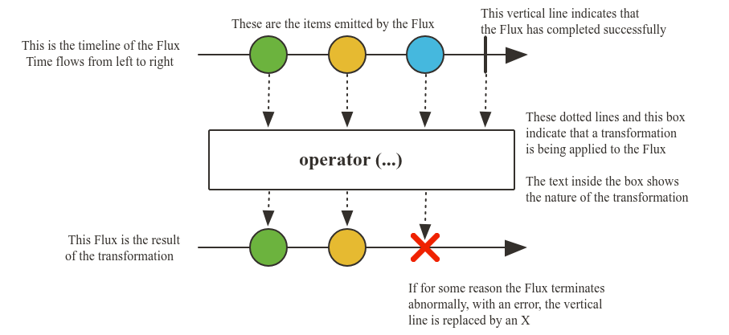
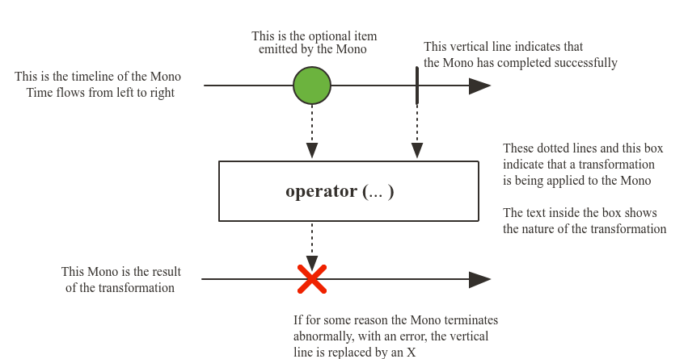

# Introdução ao Project Reactor

Project Reactor é uma biblioteca reativa baseada na especificação Reactive Streams, utilizada para construir aplicações não bloqueantes na JVM.

## Tipos principais do Reactor

### [Flux](https://projectreactor.io/docs/core/release/api/reactor/core/publisher/Flux.html)

Um Publisher do Reactive Streams com operadores reativos que emite de 0 a N elementos e, em seguida, finaliza (com sucesso ou erro).

### [Mono](https://projectreactor.io/docs/core/release/api/reactor/core/publisher/Mono.html)

Um Publisher do Reactive Streams que emite no máximo um elemento (0 ou 1). O sinal termina com um onComplete (Mono bem-sucedido, com ou sem valor) ou emite um único onError (Mono com erro).
A maioria das implementações de Mono chama imediatamente `Subscriber.onComplete()` após `Subscriber.onNext(T)`.
`Mono.never()` é uma exceção: não emite nenhum sinal, útil apenas em testes.
Combinar `onNext` e `onError` não é permitido.

## Resumo

- Biblioteca reativa baseada na especificação do Reactive Streams.
- Base para a stack reativa do Spring.
- **Flux:** representa um fluxo de 0 ou mais elementos.
- **Mono:** representa 0 ou 1 elemento.
- O consumo só inicia com o `subscribe()`.

Nesse módulo também, usamos o operador log() para conseguirmos ver mais detalhes no console. Seu objetivo é apenas dar visibilidade dos sinais emitidos a caráter de teste.
