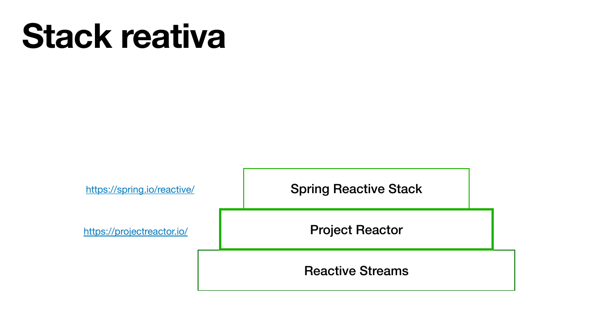
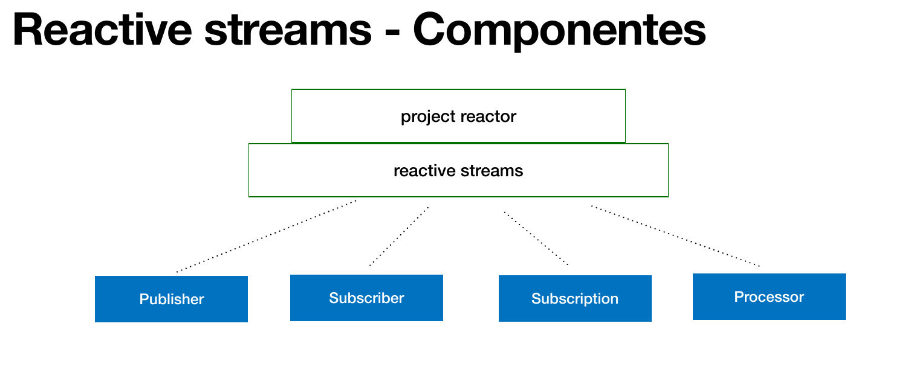
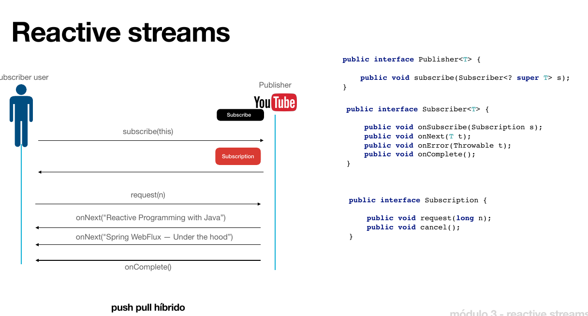

# Reactive Streams

## Stack reativa

- [Spring Reactive](https://spring.io/reactive/)
- [Project Reactor](https://projectreactor.io/)

## Reactive Streams

Reactive Streams é um padrão e especificação para bibliotecas reativas orientadas a stream para a JVM, com as seguintes características:

1. Processamento de um número potencialmente ilimitado de elementos em sequência.
2. Passagem de elementos de forma assíncrona entre os componentes.
3. Execução não bloqueante com suporte a backpressure.

> A biblioteca **Project Reactor** segue as especificações do Reactive Streams.

## Componentes do Reactive Streams

1. **Publisher:** Fonte de dados que produz elementos e os emite para os assinantes.
2. **Subscriber:** Consumidor de dados que recebe elementos do Publisher.
3. **Subscription:** Representa a relação entre Publisher e Subscriber, permitindo que o Subscriber solicite elementos do Publisher.
4. **Processor:** Atua como Publisher e Subscriber, permitindo transformação de dados entre os dois.

---

**Resumo:**

- Reactive Streams é um padrão e especificação para bibliotecas reativas.
- Composta por 4 componentes: Publisher, Subscriber, Subscription e Processor.
- A biblioteca Project Reactor implementa o Reactive Streams.
- O Project Reactor é a base para a stack reativa do Spring.

