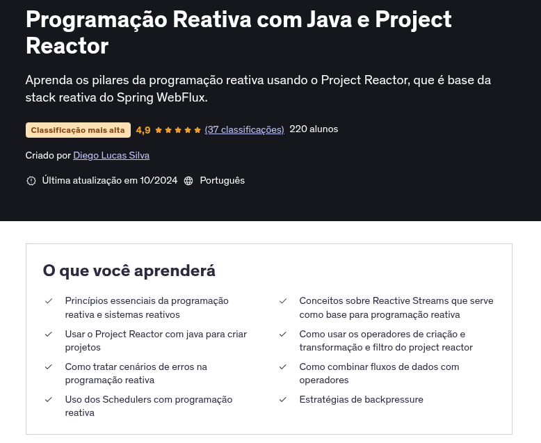

# Programação Reativa com Java e Project Reactor

Este repositório reúne anotações e exemplos práticos sobre Programação Reativa com Java e Project Reactor.

**Conceitos principais:**

- **Código bloqueante:** Interrompe a execução até a conclusão de uma operação (ex: chamada de API síncrona).
-
- **Volumetria:** Capacidade do sistema de processar grandes volumes de dados sem perda de desempenho.
-
- **Programação assíncrona:** Permite executar outras tarefas enquanto aguarda operações serem concluídas.
- **Project Reactor:** Biblioteca Java para criação de sistemas reativos, baseada em fluxos de dados assíncronos e eventos.

**Repositórios de exemplo:**

- [project-reactor-examples](https://github.com/diegolucasilva/project-reactor-examples)
- [reactive-streams-example](https://github.com/diegolucasilva/reactive-streams-example)

[Slides PDF](./projeto-reactor.pdf)

## [Conceitos importantes](./02-conceitos.md)

## [reactive-streams](./03-reactive-streams.md)

## [Introdução ao Project Reactor](./04-introducao-project-reactor.md)

## [Operadores de Criação](./05-operadores_de_criacao.md)

## [Operadores de Transformação](./06-operadores.md)

## [Operadores de Combinação](./07-combinando_fluxo_operadores.md)
