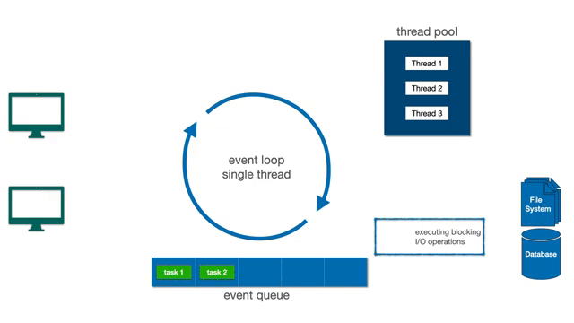

# Spring WebFlux

Spring WebFlux é um framework para construção de aplicações seguindo o paradigma da programação funcional, de forma reativa e não bloqueante.

Por padrão, o Spring Boot com WebFlux utiliza o servidor Netty, que opera no modelo de Loop de Eventos, aproveitando o processamento assíncrono e não bloqueante com o padrão reator e múltiplas threads de trabalho. Isso permite que o Netty processe um grande número de requisições simultâneas com uma única thread por loop de eventos, sem bloquear a execução de outras tarefas.

## Modelo de Loop de Eventos do Netty

Este modelo utiliza uma única thread não bloqueante para processar requisições. Principais componentes:

1. **Canal:** Representa uma conexão cliente-servidor. Quando uma solicitação chega, um Canal é criado para tratá-la. Um Canal também pode ser criado para lidar com operações de E/S (por exemplo, escrever em um banco de dados).
2. **Loop de Eventos:** Responsável pelo processamento de eventos de entrada e saída de dados. Cada EventLoop está associado a uma única thread, imutável. Tarefas podem ser criadas no EventLoop para processamento imediato ou agendado.
3. **Fila de Eventos:** Netty utiliza uma fila de eventos (Event Queue), onde as tarefas aguardam em ordem de chegada (FIFO) para serem processadas de forma assíncrona pelo EventLoop.

### Exemplo de fluxo de requisição no Netty

1. Uma requisição é enviada a uma aplicação Spring WebFlux com Netty, gerando a tarefa 3 (em laranja na imagem). Um canal é criado para processar a requisição. Já existem duas tarefas (tarefa 1 e tarefa 2) na fila de execução do Netty.
2. A tarefa 3 vai para a Fila de Eventos para aguardar sua vez no processamento do EventLoop. Nesse ponto, a tarefa 1 está sendo processada e a tarefa 2 é a próxima na fila.
3. Enquanto isso, outra solicitação é enviada ao aplicativo (tarefa 4 em vermelho) e um novo Canal é criado para lidar com ela.
4. A tarefa 4 também é adicionada à Fila de Eventos e aguarda sua vez de ser processada pelo EventLoop. Neste ponto, a tarefa 2 já foi processada.
5. O EventLoop seleciona a tarefa 3 para processamento. Esta tarefa requer uma operação de E/S mais demorada. Para não bloquear o EventLoop, esta tarefa é enviada para outra thread. Assim, o EventLoop fica disponível para executar as próximas tarefas.
6. A tarefa 4 é selecionada para processamento. Como não requer E/S, é encerrada pelo EventLoop e a resposta é enviada ao cliente.
7. A tarefa 3 é finalizada por uma thread paralela e retorna para a Fila de Eventos.
8. O EventLoop executa a próxima tarefa na fila, concluindo o processamento e retornando a resposta ao cliente.

## Conclusão

O Spring WebFlux é uma ótima escolha para projetos que exigem alta escalabilidade e eficiência. No entanto, sua curva de aprendizado pode exigir um pouco mais de esforço e tempo. Para projetos que não exigem tanta escalabilidade ou não envolvem o processamento assíncrono intenso, outras abordagens podem ser mais simples.
